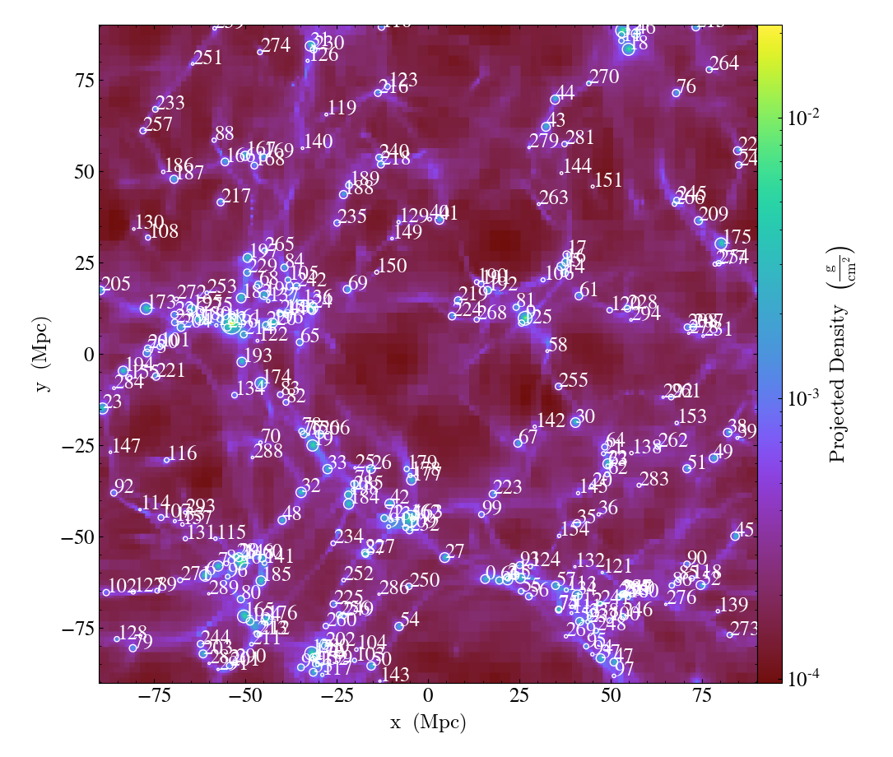

.. _annotate-halos:

Overplotting Halo Annotations
=============================

The ``yt_astro_analysis`` package includes a function that allows one
to overplot the locations of halos from a halo catalog on top of ``yt``
slices and projections. See :ref:`callbacks` for more information on
the other available plot modifications.

To add the halo annotation to the set of available plot modifications,
the following line must be added to your script.

.. code-block:: python

   import yt.extensions.astro_analysis.halo_analysis

.. function:: annotate_halos(self, halo_catalog, circle_args=None, \
                             width=None, annotate_field=None, \
                             radius_field='virial_radius', \
                             center_field_prefix="particle_position", \
                             text_args=None, factor=1.0)

   This is a proxy for
   :class:`~yt_astro_analysis.halo_analysis.halo_catalog.plot_modifications.HaloCatalogCallback`.

   This will overplot circles denoting halo locations. The radius of the circle
   is given by the "virial_radius" field, but can be changed using the
   ``radius_field`` keyword argument. The user must provide one of the following:

   #. a loaded ``yt`` :class:`~yt.data_objects.static_output.Dataset`
      of a halo catalog (e.g., a Rockstar catalog).
   #. a :class:`~yt.data_objects.data_containers.YTDataContainer` from a halo
      catalog dataset.
   #. a :class:`~yt_astro_analysis.halo_analysis.halo_catalog.halo_catalog.HaloCatalog`

.. code-block:: python

   import yt
   import yt.extensions.astro_analysis.halo_analysis

   data_ds = yt.load("Enzo_64/RD0006/RedshiftOutput0006")
   halos_ds = yt.load("rockstar_halos/halos_0.0.bin")

   p = yt.ProjectionPlot(data_ds, "z", ("gas", "density"))
   p.annotate_halos(halos_ds, annotate_field="particle_identifier")
   p.save()

